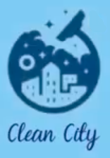
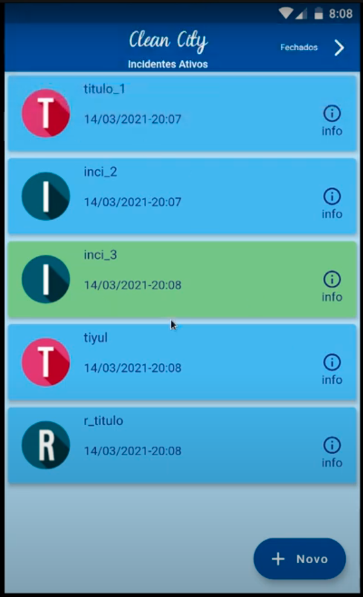

# Clean City

  

## Computação Móvel - Mini projeto (Flutter)
#### Aplicação que permite registrar, listar e resolver incidentes de saneamento de uma cidade (CRUD). Foi desenvolvida em Flutter (Dart) usando o modelo BLOC.
#### Lista dos incidentes:

  

<!-- #### URL do video de demonstração:
https://youtu.be/kWfL_glPnJ8 -->

Aluno: HÉRICLES EMANUEL SEMEDO - LEIRT 2020/21
